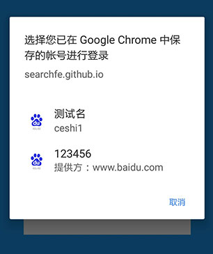
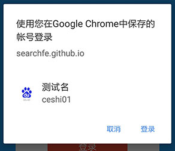
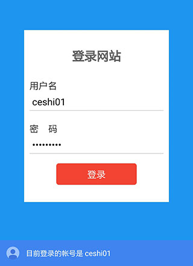

# 凭证管理 API

前文提到传统 Remember-Me 的实现方式中，通过 [cookie 存储登录信息的方式](../02-remember-me.md#cookie存储登录信息)存在安全问题，需要制定一系列校验策略和失效规则等等来确保可靠性，对开发者的技术要求较高；而通过表单登录的方式去触发浏览器的账户信息存储和自动填充的这种方法限制条件较多，且浏览器行为不可控，具体操作起来会比较麻烦。

因此浏览器提供了一套凭据管理 API（Crediential Management API），可以把用户的登录信息直接存储于客户端中，这些信息不会写到 cookie 中，因此安全性很高。同时因为账号密码直接写入本地，安全性和可靠性由浏览器保证，因此就不需要额外设计 token 之类的机制进行校验，从而大大降低开发难度。

浏览器支持情况可以查阅 [Can I Use](http://caniuse.com/#search=navigator.credentials)。

## 登录流程的异步改造

登录信息只有在验证用户登录成功之后才能进行存储，这样的登录信息才会有意义。为了能够获知用户登录成功，同时在登录成功之后调用凭证管理 API 进行用户登录信息存储，登录流程需要进行异步改造。

登录流程需要完成以下三步：

1. 实现异步登录；
2. 登录成功后调用凭证管理 API 进行登录信息存储；
3. 完成登录成功后页面切换或者是 UI 更新之类的操作。

### 实现异步登录

#### 创建登录表单

登录表单的创建比较自由，只要能够让用户输入账号密码信息并且能够让 JS 拿到相关数据即可，不一定非要构建传统的 `form` 表单，比如：

```html
<div id="login-form">
    <input name="usr" type="text">
    <input name="pwd" type="password">
    <button id="btn">提交</button>
</div>
```

由于传统 `form` 表单在数据提交时，会发生页面跳转，因此如果采用传统 `form` 表单的写法，需要监听表单提交事件并且阻止默认的提交行为，再改用 AJAX 进行表单提交：

```html
<form id="login-form">
    <input name="usr" type="text">
    <input name="pwd" type="password">
    <input type="submit" value="提交">
</form>
```

```javascript
var form = document.getElementById('login-form');

form.addEventListener('submit', function (e) {
    e.preventDefault();
    // 改用 AJAX 进行表单提交
});
```

#### 异步表单提交

异步登录的方式也没有太多的限制，可以根据实际项目自行选择 `fetch`、`jQuery`、原生XHR 等方式实现：

```javascript
var formData = new FormData(form);

// fetch
fetch('/login/site/api', {
    method: 'POST',
    body: formData
})
.then(res => {
    if (res.status === 200) {
        return Promise.resolve(res.data);
    }
    else {
        return Promise.reject();
    }
})
.then(data => {
    // 后续操作
})
.catch(err => {
    // 错误处理
})


// jQuery

$.ajax({
    url: '/login/site/api',
    data: {
        usr: formData.get('usr'),
        pwd: formData.get('pwd')
    },
    success: function (res) {
        // 后续操作
    },
    error: function (err) {
        // 错误操作
    }
})
```

登录成功之后，就可以对用户登录信息进行存储啦。

## 凭据存储

我们需要调用 `navigator.credentials.store()` 这个方法进行登录信息存储。由于仅有部分浏览器支持凭据管理 API，因此在使用前需要进行方法是否存在的判断：

```javascript
if (navigator.credentials) {
    // 使用 navigator.credentials.store 进行凭证存储
}
```

navigator.credentials.store 的方法定义如下：

`{Promise} navigator.credentials.store({Credetial} cred)`

存储凭证的方法

**返回**

- `{Promise}` : promise 对象，存储操作完成时，会返回所存储的 cred 的值。

`navigator.credentials.store` 之所以是个异步操作，是因为在调用该方法时，浏览器会弹出提示框询问用户是否对登录信息进行存储，如图所示：


只有当用户选择“保存”时，浏览器才会将登录信息存储起来，点击取消则 promise 将变成 reject。

**参数**

- `{Credetial}` cred: 凭证对象

凭证管理 API 提供了两凭据对象：[PasswordCredential](https://developer.mozilla.org/en-US/docs/Web/API/PasswordCredential) 和 [FederatedCredential](https://developer.mozilla.org/en-US/docs/Web/API/FederatedCredential)，这两种凭据对象均实现了 `Credential` 的接口，可以分别针对 `账号密码登录` 和 `第三方登录` 两种模式的登录信息进行存储。

如：

```javascript
// 账号密码登录凭证登录
if (navigator.credentials) {
    var cred = new PasswordCredential({
        id: 'TEST_ID_NUMBER',
        password: 'TEST_PASSWORD',
        name: 'TEST_NICK_NAME',
        iconURL: 'path/to/icon'
    });
    navigator.credentials.store(cred).then(cred => {
        // 后续操作
    });
}

/* ------------------------------------ */

// 第三方登录凭证存储
if (navigator.credentials) {
    var cred = new FederatedCredential({
        id: 'TEST_ID_NUMBER',
        provider: 'http://MOCK_PROVIDER',
        name: 'TEST_NICK_NAME',
        iconUrl: 'path/to/icon'
    });
    navigator.credentials.store(cred).then(cred => {
        // 后续操作
    });
}
```

关于 `PasswordCredential` 凭证对象的存储，可以[点这里](./02-password-credential.md)进一步了解。

关于 `FederatedCredential` 凭证对象的存储，可以[点这里](./03-federated-credential.md)进一步了解。

## 凭据获取

通过 `navigator.credentials.get()` 方法，可以获取同个域名下用户存储的登录信息。

举例代码如下：

```javascript
if (navigator.credentials) {
    navigator.credentials.get({
        password: true
    });
}
```

如果该域名事先有调用凭证管理 API 进行登录信息存储，在执行上述代码时，将会弹出账号选择器供用户进行账户选择：


如果存储的登录信息只有一个，那么还将会隐去账号选择器而直接将唯一的登录信息返回，并且在界面上产生如下提示信息：


自动登录的触发和自动登录提示信息的显示需要满足一系列条件，详情请参阅小节：[自动登录](#自动登录)。

navigator.credentials.get 方法的定义如下：

`{Promise} navigator.credentials.get({Object} options)`

获取凭证的方法

**返回**

- `{Promise}` : promise 对象，当获取凭证操作完成时，会返回所存储的凭证，如果找不到对应的凭证时，则返回 `null`。

**参数**

options 包含以下字段：

- `password`:
    `{boolean}` 是否支持通过密码认证登录
- `federated`: 第三方登录
    `{Object}`
    - `providers`:
        `{Array}` 联合登录账号供应者 id 组成的数组
- `unmediated`:
    `{boolean}` 是否跳过账号选择器自动登录

### 获取账号密码登录凭证

只有当 `options.password === true` 时，账号选择器才会展示类型为 `PasswordCredential` 的登录信息。

关于账号密码登录凭证信息的获取，在[帐号密码登录凭证管理](./02-password-credential.md)章节中，会进行详细说明。

### 获取第三方登录凭证配置信息

只有当 `federated.providers` 配置了相应的第三方登录账号提供者 id 列表，账号选择器才会展示类型为 `FederatedCredential`，同时账号提供者在 `providers` 列表中的登录信息。

关于第三方登录凭证信息的获取，在[第三方登录凭证管理](./03-federated-credential.md)章节中，会进行详细说明。

#### 获取登录信息过滤

我们可以通过配置不同的 options 去实现账号信息的过滤，减少用户的选择。比如配置如下的时候：

```javascript
navigator.credentials.get({
    password: true,
    federated: {
        providers: ['https://www.baidu.com']
    }
})
```

所有的账号密码凭证和第三方登录凭证信息都会罗列出来：



其中带`提供方`标识的属于第三方登录凭证信息。

如果只选择获取账号密码凭证：

```javascript
navigator.credentials.get({password: true})
```

账号选择器将只显示帐号密码凭证信息：



只选择获取第三方登录凭证：

```javascript
navigator.credentials.get({
    federated: {
        providers: ['https://www.baidu.com']
    }
})
```

账号选择器将只显示第三方凭证信息：


事实上，如果站点支持多种第三方登录的话，还可以通过配置不同的 providers 数组来进一步缩小第三方登录信息的选择范围。

### 自动登录

有时对于用户来说，在同一个网站仅仅保存了一个账号的情况下，在登录时仍然弹出账号选择器让用户选择的这个过程会显得有些多余。因此可以将 `options.unmediated` 设置为 `true`，在调用 `navigator.credentials.get(options)` 时，能够直接返回一个登录信息，省去账号选择器的显示与选择，帮助用户实现自动登录。自动登录需要满足以下条件：

- 浏览器已经显式地告知用户正在进行自动登录
- 用户曾经通过凭证管理 API 登录了网站
- 用户在该网站只保存了一个认证对象
- 用户在上一次访问时没有主动退出登录

> warn
>
> **需要注意的是**
>
> 当任一条件不满足时，这个方法将会被 `reject` 或者是返回的凭证为 `undefined`，在这种情况下账号选择器也不会显示出来，这时用户就只能手动输入账号密码了...

因此不太建议将 `unmediated` 设为 `true`，而是不对其进行任何赋值操作，让浏览器自动去判断是应该显示账号选择器还是直接实现自动登录。

在满足条件的情况下，调用 `navigator.credentials.get(options)` 方法时将不会显示账号选择器，而是直接将唯一的账号信息返回，同时显式地弹出如下提示：



## 退出登录

当用户退出网站时，应该确保用户在下次访问的时候不会自动登录。可以通过调用 `navigator.credentials.requireUserMediation()` 来关闭自动登录。

```javascript
app.logout = function () {
    // 处理登出流程
    navigator.credentials.requireUserMediation();
};
```

这样调用 `app.logout()` 登出后，如果调用 `navigator.credentials.get()` 时，将不会触发自动登录。
