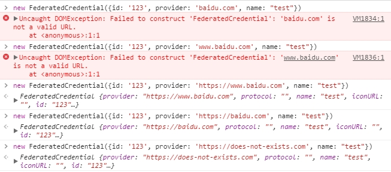

# 第三方登录凭证管理

对于用户而言，注册账号密码是一件非常麻烦的事情，不但注册过程繁琐且花时间，同时也提高了用户的账号维护成本。因此如果网站能够提供第三方登录，让用户能够直接复用一些现有且常用的网站账号，将能够大大提高用户体验。

## 接入第三方登录 API

一些大型的站点平台都会开放相应的第三方登录接口和说明文档，如国内的有：

- 百度账号接入指南：[http://developer.baidu.com](http://developer.baidu.com/wiki/index.php?title=%E5%B8%AE%E5%8A%A9%E6%96%87%E6%A1%A3%E9%A6%96%E9%A1%B5/%E7%99%BE%E5%BA%A6%E5%B8%90%E5%8F%B7%E8%BF%9E%E6%8E%A5/%E7%99%BE%E5%BA%A6%E5%B8%90%E5%8F%B7%E6%8E%A5%E5%85%A5%E6%8C%87%E5%8D%97)
- 新浪微博接入指南：[http://open.weibo.com](http://open.weibo.com/wiki/%E7%BD%91%E7%AB%99%E6%8E%A5%E5%85%A5%E4%BB%8B%E7%BB%8D)
- 微信账号接入指南：[https://open.weixin.qq.com](https://open.weixin.qq.com/cgi-bin/frame?t=home/web_tmpl&lang=zh_CN)
- QQ账号接入指南：[https://connect.qq.com/intro/login](https://connect.qq.com/intro/login)

国外的有：

- [google](https://developers.google.cn/identity/sign-in/web/)
- [facebook](https://developers.facebook.com/docs/facebook-login)
- [twitter](https://dev.twitter.com/web/sign-in/implementing)
- [github](https://developer.github.com/v3/oauth/)

## 保存第三方登录凭证

同样需要调用方法 `navigator.credentials.store()` 进行第三方登录凭证存储，只不过存入的凭证类型为 `FederatedCredential`。`FederatedCredential` 同样实现了 `Credential` 接口，同时还新增了 `provider` 字段作为第三方登录提供方的标识符。因此 `FederatedCredential` 初始化参数对象应包含以下信息：

- `id`: **必须** 账户名
- `provider`: **必须** 第三方登录提供方网址
- `name`: **非必需** 用户名
- `iconURL`: **非必需** 用户头像

其中 `provider` 要求必须是完整的带协议头的 URL 地址。我们可以在控制台做如下实验：



可以看到，浏览器会校验 provider 的格式，当格式不符合 URL 格式时会抛出错误。

这样，我们就可以使用 `FederatedCredential` 对第三方登录信息进行存储啦。

例如：

```javascript
/* global THIRD_PARTY_PROVIDER */

thirdPartyLogin()
    .then(function (profile) {
        if (navigator.credentials) {
            let cred = new FederatedCredential({
                id: profile.email,
                provider: THIRD_PARTY_PROVIDER,
                name: profile.name,
                iconUrl: profile.iconUrl
            });

            return navigator.credentials.store(cred);
        }

        return profile;
    })
    .then(function (profile) {
        // 后续操作
    })
    .catch(function (err) {
        // 错误处理
    });
```

## 读取第三方登录凭证

需要调用方法 `navigator.credentials.get()` 方法进行第三方登录凭证的读取。

在前文[凭据获取](./introduction.md#凭据获取)章节中提到，`navigator.credentials.get(options)` 方法传入参数包含一个字段 `federated`，可以通过这个字段去读取第三方登录的凭证信息。

- `options.federated`: 第三方登录
    `{Object}`
    - `providers`:
        `{Array}` 联合登录账号供应者 id 组成的数组

例如：

```javascript
navigator.credentials.get({
    federated: {
        providers: ['https://www.baidu.com', 'https://www.weibo.com', 'https://www.github.com']
    }
});
```

这些 `providers` 需要与 `FederatedCredential` 第三方登录凭证信息的 `provider` 相一致。

这样假设存入的第三方登录凭证如下：

```javascript
let cred = new FederatedCredential({
    id: '123456',
    provider: 'https://www.baidu.com',
    name: '测试百度用户名',
    iconUrl: 'path-to-icon'
});
```

则在弹出的账号选择列表中，就可以看到如下所示的账号信息：


那些带有`提供方`描述字样的信息就是对应的第三方登录凭证信息。没错，不同于密码凭证信息，第三方登录凭证信息会拿 `id` 字段作为账号的标识。

对于不同的第三方登录具有不同的处理方式，因此在获取到第三方登录凭证信息之后，需要通过 `type` 和 `provider` 字段进行凭证信息分类处理，如：

```javascript
navigator.credentials.get({
    password: true,
    federated: {
        providers: ['https://www.baidu.com', 'https://www.weibo.com']
    }
})
.then(function (cred) {
    if (cred) {
        switch (cred.type) {
            case 'password':
            // PasswordCredential 凭证处理
            case 'federated':
                // FederatedCredential 凭证处理
                switch (cred.provider) {
                    case 'https://www.baidu.com':
                        // 调起百度第三方登录
                    case 'https://www.weibo.com':
                        // 调起微博第三方登录
                }
        }
    }
});
```
## 第三方登录示例

完整的示例代码可以 [戳这里](https://github.com/lavas-project/lavas-project.github.io/blob/master/pwa-demo/credential-demo/third-party.html)

第三方登录界面如下：


点击登录界面的`百度登录`按钮，即可触发模拟第三方登录。相关代码如下：

```html
<button id="login-btn" data-provider="https://www.baidu.com">百度登录</button>
```

```javascript
$btn.addEventListener('click', function () {
    let provider = this.dataset.provider;
    // 假装 fetch('./third-party.json') 是调用百度第三方登录的过程
    fetch('./third-party.json')
    .then(res => {
        if (res.status === 200) {
            return res.json();
        }

        return Promise.reject(res.status);
    })
    // 此处假装第三方登录并授权成功
    .then(data => {
        // 此处调用凭证管理 API 进行第三方登录信息存储
        if (navigator.credentials) {
            // 生成第三方登录凭证
            let cred = new FederatedCredential({
                id: data.uid,
                provider: provider,
                name: data.name,
                iconURL: data.icon
            });
            // 存储
            return navigator.credentials.store(cred)
                .then(() => {
                    return data;
                });
        }

        return Promise.resolve(data);
    })
    // 存储完成后再跳转至登录成功页
    .then(data => {
        window.location.href = './main.html?from=third-party&username=' + data.name;
    });
});
```

其中模拟第三方授权登录的 `third-party.json` 返回如下：

```javascript
{
    "name": "测试百度用户名",
    "uid": "123456",
    "icon": "https://lavas-project.github.io/pwa-demo/credential-demo/images/logo-48x48.png"
}
```

跳转到成功页时将提示如下信息：


点击保存并重新打开登录页面时，将弹出如下账号选择器：


可以看到提供方为 `www.baidu.com` 的账号信息显示在账号选择器列表中。对应的代码如下所示：

```javascript
if (navigator.credentials) {
    navigator.credentials.get({
        password: true,
        federated: {
            providers: ['https://www.baidu.com']
        }
    })
    .then(cred => {
        if (cred) {
            switch (cred.type) {
                case 'federated':
                    // FederatedCredential 凭证处理
                    switch (cred.provider) {
                        case 'https://www.baidu.com':
                            // 调起百度第三方登录
                            window.location.href = './main.html?from=third-party&username=' + cred.name;
                    }
                // ...
            }
        }
    });
}
```
