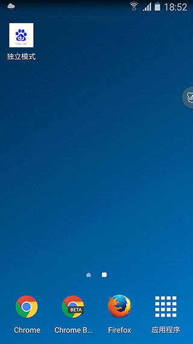
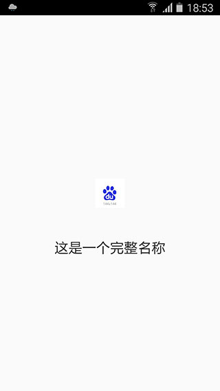
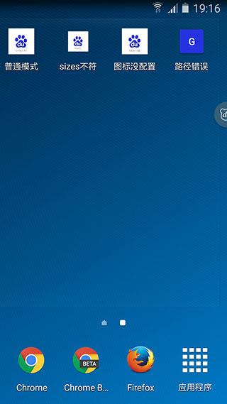

# 基本功能

本文将介绍 manifest.json 的一些基本配置，通过这些基本配置，能够使得 PWA 站点能够成功添加至主屏幕。

- [自定义名称](#自定义名称)
- [自定义图标](#自定义图标)
- [设置启动网址](#设置启动网址)
- [设置作用域](#设置作用域)

## 自定义名称

PWA在通过应用安装横幅引导用户安装 app，以及被添加到主屏幕时，需要显示应用名称以便用户将其与其他网站区分开来。对应的属性为：

- `name`:
    `{string}` 应用名称，用于安装横幅、启动画面显示
- `short_name`:
    `{string}` 应用短名称，用于主屏幕显示

之所以用两个字段做区分，是由于显示在主屏幕的应用名称长度有限，超长部分会被截断并显示省略号，需要设置较短的应用名称优化显示；而安装横幅没有长度限制，可以将完整的应用名称显示出来。

> info
>
> 目前如果修改了 manifest.json 的应用名称，已添加到主屏幕的名称并不会改变，只有当用户重新添加到桌面时，更改后的名称才会显示出来。但是在未来版本的 Chrome 浏览器将支持名称自动更新，详情请戳：[Updating your app's icon and name](https://developers.google.com/web/updates/2017/02/improved-add-to-home-screen#updating_your_apps_icon_and_name)。

### 示例

```json

{
    "name": "这是一个完整名称",
    "short_name": "独立模式",
    // ...
}

```

通过上述配置信息，得到的 PWA 的主屏幕应用显示、安装横幅、启动画面将如下图所示：






## 自定义图标

当用户将 PWA 添加至主屏幕时，会如同原生应用一样显示应用名和图标。我们可以通过 `icons` 属性定义一组不同大小的图标供浏览器进行选择。

- `icons`:
    `{Array.<ImageObject>}` 应用图标列表

其中 ImageObject 的属性值包括：

- `src`:
    `{string}` 图标 url
- `type`
    `{string=}` 图标的 mime 类型，非必填项，该字段可让浏览器快速忽略掉不支持的图标类型。
- `sizes`
    `{string}` 图标尺寸，格式为`widthxheight`，宽高数值以 css 的 `px` 为单位。如果需要填写多个尺寸，则使用空格进行间隔，如"48x48 96x96 128x128"。

更详尽的ImageObject介绍，请参阅 [Image object and its members](https://www.w3.org/TR/appmanifest/#dfn-image-object)。

当PWA添加到主屏幕时，浏览器会根据有效图标的 sizes 字段进行选择。首先寻找与显示密度相匹配并且尺寸调整到 48dp 屏幕密度的图标；如果未找到任何图标，则会查找与设备特性匹配度最高的图标；如果匹配到的图标路径错误，将会显示浏览器默认 icon。

> warn
>
> **需要注意的是**
>
> 1. 为了能够自动显示安装横幅，必须要配置一个 sizes 为 `144x144` 的图标，且图标的 mime 类型为 `image/png`。详情请参阅[应用安装横幅](#引导用户添加应用至主屏幕)章节；
2. 在启动应用时，启动画面图像会从图标列表中提取最接近 `128dp` 的图标进行显示。详情请参阅[添加应用启动画面](#添加启动画面)章节。
3. 目前如果修改了 manifest.json 的图标列表，已添加到主屏幕的名称并不会改变，只有当用户重新添加到桌面时，更改后的图标才会显示出来。但是在未来版本的 Chrome 浏览器将支持图标自动更新，详情请戳：[Updating your app's icon and name](https://developers.google.com/web/updates/2017/02/improved-add-to-home-screen#updating_your_apps_icon_and_name)。


### 示例

例如图标列表的配置为：

```json
// 正常模式
"icons": [
    {
        "src": "path-to-images/icon-96x96.png",
        "type": "image/png",
        "sizes": "96x96"
    },
    {
        "src": "path-to-images/icon-144x144.png",
        "type": "image/png",
        "sizes": "144x144"
    }
]

// sizes 与图标实际尺寸不匹配
"icons": [
    {
        "src": "path-to-images/icon-96x96.png",
        "type": "image/png",
        "sizes": "144x144"
    },
    {
        "src": "path-to-images/icon-144x144.png",
        "type": "image/png",
        "sizes": "96x96"
    }
]

// 缺少144x144的图片
"icons": [
    {
        "src": "path-to-images/icon-96x96.png",
        "type": "image/png",
        "sizes": "96x96"
    },
    {
        "src": "path-to-images/icon-188x188.png",
        "type": "image/png",
        "sizes": "188x188"
    }
]

// 144x144的图片地址错误
"icons": [
    {
        "src": "path-to-images/icon-96x96.png",
        "type": "image/png",
        "sizes": "96x96"
    },
    {
        "src": "path-to-images/icon-144x144-not-exist.png",
        "type": "image/png",
        "sizes": "144x144"
    }
]
```

通过该配置信息，得到的 PWA 主屏应用显示将如下图所示：




## 设置启动网址

当PWA添加到主屏幕后，需要通过 `start_url` 去指定应用打开的网址。

- `start_url`:
    `{string=}` 应用启动地址

如果该属性为空，则默认使用当前页面，这可能不是用户想要的内容，因此建议配置 start_url；如果 start_url 配置的相对地址，则基地址与 manifest.json 相同。

### 示例

假设 PWA 文件结构为：

```

https://test.baidu.com
    |
    |----manifest.json
    |
    |----index.html
    |
    |----detail.html


```

manifest.json 对应的 start_url 如果采用绝对地址的形式，其配置如下：

```json

{
    "start_url": "/index.html",
    // ...
}

```

等价于如下相对地址：

```json

{
    "start_url": "./index.html",
    // ...
}

```

假设用户在 detail.html 页面将应用添加至首屏，如果 start_url 为空，从首屏打开应用时，打开的页面将是 `/detail.html`

可使用 Chrome 分别访问 [index](https://searchfe.github.io/pwa-demo/manifest-demo/start-url/index.html) 和 [detail](https://searchfe.github.io/pwa-demo/manifest-demo/start-url/detail.html)进行验证。

## 设置作用域

对于一些大型网站而言，有时仅仅对站点的某些模块进行 PWA 改造，其余部分仍为普通的网页。因此需要通过 `scope` 属性去限定作用域，超出范围的部分会以浏览器的方式显示。

- `scope`:
    `{string}` 作用域

> info
>
> scope 属性在浏览器中的实现仍然在细化和改进。

scope 应遵循如下[规则](https://developers.google.com/web/updates/2017/02/improved-add-to-home-screen#effectively_managing_your_apps_scope)：

- 如果没有在 manifest 中设置 scope，则默认的作用域为 manifest.json 所在文件夹；
- scope 可以设置为 `../` 或者更高层级的路径来扩大PWA的作用域；
- `start_url` 必须在作用域范围内；
- 如果 `start_url` 为相对地址，其根路径受 scope 所影响；
- 如果 `start_url` 为绝对地址（以 `/` 开头），则该地址将永远以 `/` 作为根地址；

### 示例

| manifest url              | start_url                 | scope配置  | 计算好的scope | 计算好的start_url                 | 是否有效                         |
| ------------------------- | ------------------------- | ---------- | ------------- | --------------------------------- | -------------------------------- |
| /tech-today/manifest.json | ./index.html              | undefined  | /tech-today/  | /tech-today/index.html            | 有效                             |
| /tech-today/manifest.json | ./index.html              | ../        | /             | /index.html                       | 有效 - 但作用域泄露到了更高层级  |
| /tech-today/manifest.json | /                         | /          | /             | /index.html                       | 有效 - 但作用域泄露到了更高层级  |
| /tech-today/manifest.json | /                         | undefined  | /tech-today/  | /                                 | 无效 - start url不在作用域范围内 |
| /tech-today/manifest.json | ./tech-today/index.html   | undefined  | /tech-today/  | /tech-today/tech-today/index.html | 有效 - 但start url明显不符合预期 |
| /manifest.json            | ./tech-today/index.html   | undefined  | /             | /tech-today/index.html            | 有效 - 广作用域                  |
| /manifest.json            | ./tech-today/index.html   | tech-today | /tech-today/  | /tech-today/index.html            | 有效 - 窄作用域                  |
