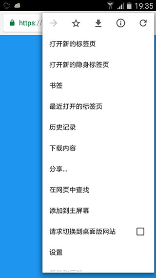
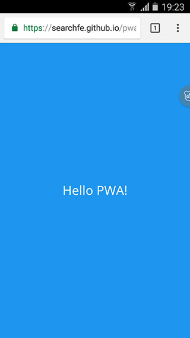
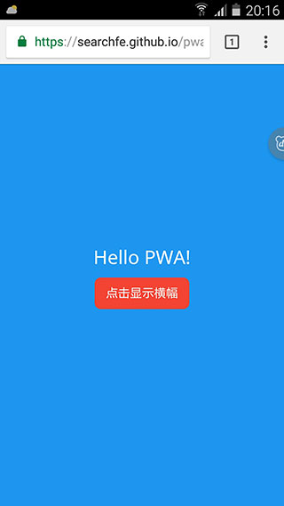

# 应用添加横幅

PWA 提供两种添加应用横幅，分别实现**引导用户添加 PWA 至桌面**和**引导用户下载原生应用**的功能。本文将介绍如何实现应用安装横幅的实现及管理。

- [引导用户添加应用](#引导用户添加应用至主屏幕)
- [引导用户安装原生应用](#引导用户安装原生应用)

## 引导用户添加应用至主屏幕

引导用户将 PWA 添加至主屏幕，不但能够为用户提供更好的应用体验，更为重要的是，还能够使得用户方便快捷地打开网站，既增加了站点访问量，同时也提高了用户粘性。

如下图所示，打开浏览器菜单，会看到`添加到主屏幕`的功能，用户可以点击该选项手动将 PWA 站点添加至主屏幕。



很明显对于大部分用户来说，都不会主动去完成上述操作，因此需要适时地弹出`应用安装横幅`去引导用户进行添加操作。PWA 提供的应用安装横幅如下图所示：


用户只需点击横幅上的`添加应用`按钮，即可将 PWA 添加到他们的主屏幕。相比起用户主动操作，弹出应用安装横幅的形式更直观，操作更简便，用户的应用添加率也会更高。

### 显示应用安装横幅的条件

浏览器在 PWA 站点满足以下条件时会自动显示横幅：

- 站点部署 manifest.json，该文件需配置如下属性：
    - [short_name](./02-basic-conditions.md#自定义名称) （用于主屏幕显示）
    - [name](./02-basic-conditions.md#自定义名称) （用于安装横幅显示）
    - [icons](./02-basic-conditions.md#自定义图标) （其中必须包含一个 `144x144` 且 mime 类型为 `image/png` 的图标声明）
    - [start_url](./02-basic-conditions.md#设置启动网址) （应用启动地址）
    - [display](./03-improved-webapp-experience.md#设置显示类型) （必须为 `standalone` 或 `fullscreen`）
- 站点注册 Service Worker。
- 站点支持 HTTPS 访问。
- 站点在同一浏览器中被访问至少两次，两次访问间隔至少为 5 分钟。

**注** 应用安装横幅是一种新兴的技术，对应的显示横幅的条件在将来可能会有所变化。

### 应用安装横幅事件

浏览器会根据 manifest.json 提供的相关配置生成应用安装横幅，同时使用一组条件和访问频率启发式算法来确定何时显示横幅。一般来说，浏览器管理触发提示的时间，不一定满足网站需求，因此浏览器也提供了一些事件接口供网站开发者使用。

#### 判断用户是否安装此应用

`beforeinstallprompt` 事件返回一个名为 `userChoice` 的 Promise 对象，并在当用户对横幅进行操作时进行解析。promise 会返回属性 `outcome`，该属性的值为 `dismissed` 或 `accepted`，如果用户将网页添加到主屏幕，则返回 `accepted`。

例如：

```javascript
window.addEventListener('beforeinstallprompt', function (e) {
    // beforeinstallprompt event fired

    e.userChoice.then(function (choiceResult) {
        if (choiceResult.outcome === 'dismissed') {
            console.log('用户取消安装应用');
        }
        else {
            console.log('用户安装了应用');
        }
    });
});
```

利用 `userChoice` 返回的 Promise 对象，可以根据用户的安装选择结果进行互动。


#### 取消或延迟安装横幅的触发事件

网站虽然不能主动触发安装横幅的显示事件，但是当该事件被浏览器触发之后，可以对其进行取消或者延迟。

通过阻止 `beforeinstallprompt` 事件的默认行为，即可取消横幅弹出：

```javascript
window.addEventListener('beforeinstallprompt', function (e) {
    e.preventDefault();
    return false;
});
```

`beforeinstallprompt` 事件返回一个名为 `prompt` 的方法，通过执行该方法可以触发安装横幅的显示。为了实现显示事件的延迟操作，可以将 beforeinstallprompt 事件的返回值给存储起来，再异步地调用 `prompt()`。

```javascript
var deferredPrompt = null;

window.addEventListener('beforeinstallprompt', function (e) {
    // 将事件返回存储起来
    deferredPrompt = e;

    // 取消默认事件
    e.preventDefault();
    return false;
});

// 当按钮点击事件触发的时候，再去触发安装横幅的显示
button.addEventListener('click', function () {
    if (deferredPrompt != null) {
        // 异步触发横幅显示
        deferredPrompt.prompt();
        deferredPrompt = null;
    }
});
```

通过 `prompt()` 触发显示的横幅，同样可以通过 `userChoice` 去监测用户的安装行为：

```javascript
button.addEventListener('click', function () {
    if (deferredPrompt != null) {
        // 异步触发横幅显示
        deferredPrompt.prompt();
        // 检测用户的安装行为
        deferredPrompt.userChoice.then(function (choiceResult) {
            console.log(choiceResult.outcome);
        });

        deferredPrompt = null;
    }
});

```

### 示例

完整的项目代码可以[戳这里](https://github.com/lavas-project/lavas-project.github.io/tree/master/pwa-demo/manifest-demo/add-to-home-screen/delay)。

示例项目结构如下：

```
|
|----index.html
|
|----manifest.json
|
|----sw.js // Service Worker
```

manifest.json 的配置如下：

```javascript
{
    "short_name": "短名称",
    "name": "这是一个完整名称",
    "icon": [
        {
            "src": "../../images/logo-144x144.png",
            "type": "image/png",
            "sizes": "144x144"
        }
    ],
    "start_url": "./index.html"
}
```

对应的横幅显示如下图所示：


代码添加事件监听：

```javascript
window.addEventListener('beforeinstallprompt', function (e) {
    e.userChoice.then(function (choiceResult) {
        alert(choiceResult.outcome);
    });
});
```

则点击添加效果如下图所示：


将事件监听更改如下：

```javascript
var dfdPrompt = null;
var button = document.getElementById('btn');

window.addEventListener('beforeinstallprompt', function (e) {
    // 存储事件
    dfdPrompt = e;
    // 显示按钮
    button.style.display = 'block';
    // 阻止默认事件
    e.preventDefault();
    return false;
});

button.addEventListener('click', function (e) {
    if (dfdPrompt == null) {
        return;
    }
    // 通过按钮点击事件触发横幅显示
    dfdPrompt.prompt();
    // 监控用户的安装行为
    dfdPrompt.userChoice.then(function (choiceResult) {
        alert(choiceResult.outcome);
    });
    // 隐藏按钮
    button.style.display = 'none';
    dfdPrompt = null;
});
```

当浏览器触发横幅显示事件时，页面中的按钮将显示出来，同时横幅显示事件被取消；点击按钮时，应用安装横幅才会显示出来：






## 引导用户安装原生应用

PWA 站点允许定义类似应用安装横幅的形式去推广原生应用。

### 显示原生应用安装横幅的条件

浏览器在 PWA 站点满足以下条件时会自动显示横幅：

- 站点部署 manifest.json，该文件需配置如下属性：
    - [short_name](./02-basic-conditions.md/#自定义名称) （用于主屏幕显示）
    - [name](./02-basic-conditions.md/#自定义名称) （用于安装横幅显示）
    - [icons](./02-basic-conditions.md/#自定义图标) （其中必须包含一个 `144x144` 且 mime 类型为 `image/png` 的图标声明）
    - 包含原生应用相关信息的 `related_applications` 对象
- 站点注册 Service Worker。
- 站点支持 HTTPS 访问。
- 站点在同一浏览器中被访问至少两次，两次访问间隔至少为 `2` 天。

其中 `related_applications` 的定义如下：

- `related_applications`:
    `Array.<AppInfo>` 关联应用列表

AppInfo 的属性值包括：

- `platform`:
    `{string}` 应用平台
- `id`:
    `{string}` 应用id

例如：

```javascript
"related_applications": [
    {
        "platform": "play",
        "id": "com.baidu.samples.apps.iosched"
    }
]
```

如果只希望用户安装原生应用，而不需要弹出横幅引导用户安装 PWA，那么可以在 manifest.json 设置：

```javascript
"prefer_related_applications": true
```
