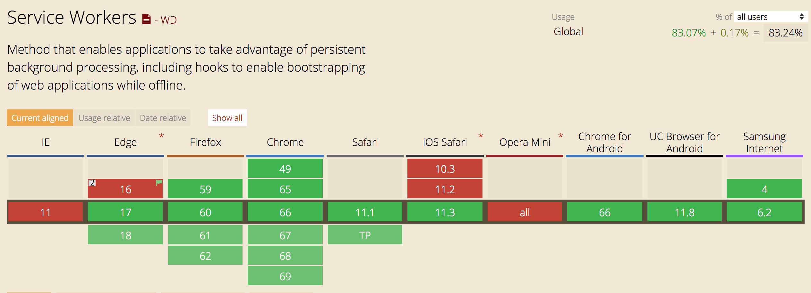
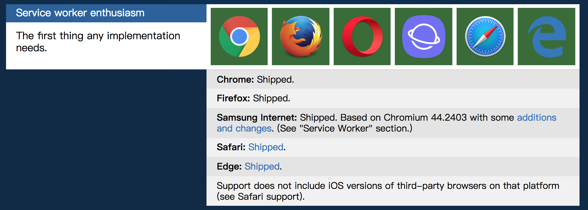

# Service Worker 简介

## 背景：如何让网页的用户体验做到极致

随着 Web 的快速发展，用户对站点的体验期望值越来越高，前端工程师有时候为了几十毫秒的速度优化而费劲心思，消耗大量时间。想要让自己的产品在无数产品中脱颖而出，就必须提升产品的性能和体验。在时间成本高昂的今天，响应速度的提升是开发者不得不面对的话题。

前端工程师有很多性能优化的手段，包括 CDN、CSS Sprite、文件的合并压缩、异步加载、资源缓存等等。其实我们绝大部分情况是在干一件事情，那就是尽量降低一个页面的网络请求成本从而缩短页面加载资源的时间并降低用户可感知的延时。当然减少用户可感知的延时也不仅仅是在网络请求成本层面，还有浏览器渲染效率，代码质量等等。

那么到了今天，如果有人告诉你：“`我们的站点可以秒开，离线的情况下也能浏览，不是 file:// 协议的哦！`”，你是不是要送他一个大大的问号脸？

我们这里要讲到的是一个叫做 Service Worker 的东东。

## 什么是 Service Worker

W3C 组织早在 2014 年 5 月就提出过 Service Worker 这样的一个 HTML5 API ，主要用来做持久的离线缓存。

当然这个 API 不是凭空而来，至于其中的由来我们可以简单的捋一捋：

浏览器中的 javaScript 都是运行在一个单一主线程上的，在同一时间内只能做一件事情。随着 Web 业务不断复杂，我们逐渐在 js 中加了很多耗资源、耗时间的复杂运算过程，这些过程导致的性能问题在 WebApp 的复杂化过程中更加凸显出来。

W3C 组织早早的洞察到了这些问题可能会造成的影响，这个时候有个叫 Web Worker 的 API 被造出来了，这个 API 的唯一目的就是解放主线程，Web Worker 是脱离在主线程之外的，将一些复杂的耗时的活交给它干，完成后通过 postMessage 方法告诉主线程，而主线程通过 onMessage 方法得到 Web Worker 的结果反馈。

一切问题好像是解决了，但 Web Worker 是临时的，我们能不能有一个东东是一直持久存在的，并且随时准备接受主线程的命令呢？基于这样的需求推出了最初版本的 Service Worker ，Service Worker 在 Web Worker 的基础上加上了持久离线缓存能力。当然在 Service Worker 之前也有在 HTML5 上做离线缓存的 API 叫 AppCache, 但是 AppCache 存在很多 [不能忍受的缺点](https://alistapart.com/article/application-cache-is-a-douchebag)。

W3C 决定 AppCache 仍然保留在 HTML 5.0 Recommendation 中，在 HTML 后续版本中移除。

- Issue: [https://github.com/w3c/html/issues/40](https://github.com/w3c/html/issues/40)

- Mailing list: [https://lists.w3.org/Archives/Public/public-html/2016May/0005.html](https://lists.w3.org/Archives/Public/public-html/2016May/0005.html)

WHATWG HTML5 作为 Live Standard，也将 AppCache 标注为 `Discouraged` 并引导至 Service Worker。

Ok ，那么 Service Worker 到底用来干啥的呢？

Service Worker 有以下功能和特性：

- 一个独立的 worker 线程，独立于当前网页进程，有自己独立的 worker context。

- 一旦被 install，就永远存在，除非被 uninstall

- 需要的时候可以直接唤醒，不需要的时候自动睡眠（有效利用资源，此处有坑）

- 可编程拦截代理请求和返回，缓存文件，缓存的文件可以被网页进程取到（包括网络离线状态）

- 离线内容开发者可控

- 能向客户端推送消息

- 不能直接操作 DOM

- 出于安全的考虑，必须在 HTTPS 环境下才能工作

- 异步实现，内部大都是通过 Promise 实现

所以我们基本上知道了 Service Worker 的伟大使命，就是让缓存做到优雅和极致，让 Web App 相对于 Native App
的缺点更加弱化，也为开发者提供了对性能和体验的无限遐想。

## 浏览器支持情况

虽说 W3C 组织为了让用户体验做到极致操碎了心提出了这么有用的 API ，但是根据以往经验我们可以知道标准或草案的提出之后各大浏览器的实现步伐是不一样的，那么 Service Worker 这么好用的东西到底浏览器支持情况怎么样呢？参考 [Can I use](https://caniuse.com/#search=service%20worker) 可得下图：

看到这张图还是相当激动的，至少也绿了一片，总结一下：

- Chrome 作为开路先锋早早的在 V40 版本就支持了，还提供了完善的 debug 方案（ [Service Worker debug](./service-worker-debug.md) ）

- Firefox，Opera 不甘示弱在后续版本也进行了支持

- 安卓手机 4.x 以上版本新系统形势一片大好（具体各手机的实现还得进一步探测）

- 安卓 Chrome 同样给力

- iOS。。

- IE。。

这里说明一下，由于 Apple 的个性突出，iOS 内的所有的浏览器其实都是用 safari 的核，也就是说如果 iOS safari 不支持，iOS 所有浏览器就都不支持了，当然 Apple 官方在 2015 年暗示过，Service Worker 的支持在他们的 [5年计划内](https://trac.webkit.org/wiki/FiveYearPlanFall2015)，不揣测任何原因，我们就翘首以盼就好了，掐指一算一统江湖的好日子应该就这几年的事情了。

[微软表态了](https://developer.microsoft.com/en-us/microsoft-edge/platform/status/serviceworker)：IE是来不及支持 Service Worker 了，但是目前 Microsoft Edge 的支持情况是 `in Development in Microsoft Edge on Desktop, Mixed Reality, Mobile and Xbox`

现在最新的实现情况是这个样子的：

如果想了解更多，[https://jakearchibald.github.io/isserviceworkerready](https://jakearchibald.github.io/isserviceworkerready) 有更详细的最新浏览器支持情况。
